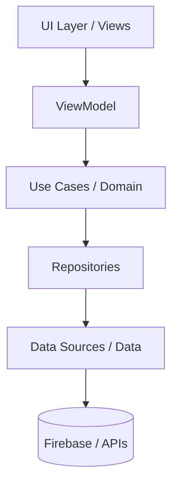

# UMAS: UMak App Store

[](https://developer.android.com)
[](https://flutter.dev)
[](#architecture)

**UMAS (University of Makati App Store)** is a specialized application distribution platform tailored for the University of Makati community. Developed to streamline the discovery, installation, and management of university-internal applications, UMAS provides a centralized hub for students and faculty to access academic and administrative tools securely.

## 🚀 Key Features

- **Centralized App Distribution:** Seamlessly download and install university-approved applications.
- **User Management:** Secure authentication using UMak credentials and comprehensive profile management.
- **Interactive Ecosystem:** Ratings, reviews, and feedback systems for continuous improvement.
- **Real-time Notifications:** Stay updated with app releases, updates, and university announcements.
- **Library Management:** Manage installed apps, track updates, and view device storage metrics.

---

## 🛠 Tech Stack

### Core
- **Framework:** [Flutter](https://flutter.dev) (Cross-platform toolkit for high-performance apps)
- **Language:** Dart
- **Architecture:** Clean Architecture + MVVM (Model-View-ViewModel)

### Backend & Infrastructure
- **Authentication:** Firebase Auth (Google Sign-In integration)
- **Database:** Cloud Firestore (NoSQL real-time document store)
- **Media Hosting:** [Cloudinary](https://cloudinary.com) (Asset management & image optimization)
- **Security:** Firebase App Check

### Key Libraries
- **Networking:** `Dio` & `http` for RESTful interactions.
- **Local Persistence:** `shared_preferences` and `path_provider`.
- **Media & UI:** Cloudinary API, `google_fonts`, `flutter_svg`, `shimmer`, and `cached_network_image`.
- **Platform Integration:** `flutter_downloader`, `permission_handler`, `external_app_launcher`, and `device_info_plus`.

---

## 🏁 Getting Started

### Prerequisites
- **Flutter SDK:** `^3.11.0`
- **Android Studio:** Latest Flamingo or Hedgehog version recommended.
- **JDK:** Java 11 or higher.

### Installation & Environment Setup

1. **Clone the repository:**
   ```bash
   git clone https://github.com/ismemax/UMakstore.git
   cd UMakstore
   ```

2. **Install dependencies:**
   ```bash
   flutter pub get
   ```

3. **Handle API Keys & Environment Variables:**
   We use `android/local.properties` to manage sensitive configuration and environment-specific paths. Create or edit the file and add your credentials:
   ```properties
   # android/local.properties
   sdk.dir=C\:\\Users\\YourUser\\AppData\\Local\\Android\\Sdk
   FIREBASE_API_KEY=your_api_key_here
   # Add other environment-specific keys as needed for native integrations
   ```

4. **Firebase Configuration:**
   Ensure your `google-services.json` (Android) and `GoogleService-Info.plist` (iOS) are properly placed in their respective platform directories to initialize Firebase services.

5. **Run the application:**
   ```bash
   # For Android
   flutter run --flavor dev
   ```

---

## 🏗 Architecture

The project follows **Clean Architecture** principles combined with **MVVM** to ensure separation of concerns, high testability, and maintainable data flow.

### Layered Breakdown:
1. **Data Layer (Implementation):**
   - **Repositories:** Implementation of domain repository interfaces.
   - **Data Sources:** Direct interactions with Firebase Firestore, Storage, and external REST APIs.
2. **Domain Layer (Business Logic):**
   - **Entities:** Core business objects.
   - **Use Cases:** Atomic business rules (e.g., `InstallApp`, `SubmitReview`).
   - This layer is "pure" and has no dependencies on Flutter or external libraries.
3. **UI/Presentation Layer (MVVM):**
   - **Views:** Declarative UI components.
   - **ViewModels:** Manages UI state and coordinates with Use Cases.
   - **Models:** Reactive state representations.



---

## 📖 Project Documentation

For in-depth technical details, please refer to our internal documentation:

- **[Architecture Overview](docs/ARCHITECTURE.md)**: Design patterns, state management, and project structure.
- **[Database Schema](docs/DATABASE_SCHEMA.md)**: Firestore collection mappings and data models.
- **[Media Strategy](docs/MEDIA_STRATEGY.md)**: Cloudinary configuration and image optimization logic.
- **[Security & Roles](docs/SECURITY_ROLES.md)**: RBAC (Role-Based Access Control) and authorization flow.
- **[Release Guide](docs/RELEASE_GUIDE.md)**: Building, signing, and deploying the application.

---

## 🤝 Contributing & Standards

- **Linting:** We use the `flutter_lints` package. Run `flutter analyze` before committing.
- **Branch Strategy:** We follow GitFlow. Features branch off `develop` and are merged via Pull Requests.
- **Documentation:** Modern documentation is required for all new features and public APIs.

---

## 📄 License

Distributed under the MIT License. See `LICENSE` for more information.

---
*Created and maintained by the UMak Development Team.*
